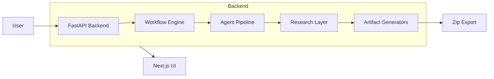
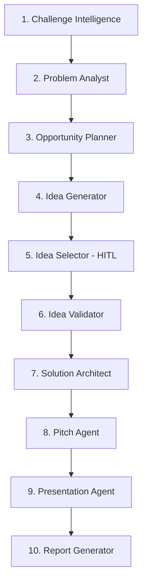

# exHacker

> AI-Powered Hackathon Co-Pilot — Transform a challenge statement into validated ideas, architecture, presentations, and pitches through a multi-agent workflow.

[](https://python.org)
[](https://fastapi.tiangolo.com)
[](https://nextjs.org)
[](https://typescriptlang.org)
[](https://langchain-ai.github.io/langgraph/)
[](LICENSE)
[](.github/workflows/ci.yml)

---

## Project Overview

**exHacker** automates the planning phase of hackathons. Instead of spending hours analyzing challenges, brainstorming, and designing architecture, teams run a structured 10-step AI agent pipeline that produces:

- Challenge intelligence and problem analysis
- Validated solution ideas with market research
- System architecture and tech stack recommendations
- Pitch scripts and presentation decks
- Exportable project artifacts (README, PRD, implementation guide)

The goal is not to replace builders — it is to eliminate planning overhead so teams can focus on building.

---

## Architecture



---

## Agent Pipeline



- **Steps 1–4**: Autonomous AI analysis
- **Step 5**: Human-in-the-loop — user selects the best idea
- **Steps 6–10**: Autonomous AI generation with user review checkpoints

---

## Features

| Feature | Description |
|---------|-------------|
| Challenge Analysis | Parses hackathon statements, identifies constraints and success metrics |
| Idea Generation | Produces ranked solution ideas with scoring |
| Market Research | Competitor analysis, API discovery, open-source library search |
| HITL Selection | Human-in-the-loop idea selection with structured comparison |
| Architecture Design | System diagrams, tech stack, component breakdown |
| Pitch Generation | 30s, 2min, and 5min pitch scripts |
| Presentation | Slide deck with speaker notes |
| Artifact Export | README, PRD, implementation guide + zip download |
| Provider Fallback | Auto-failover across Groq → Gemini → Ollama → OpenAI |

---

## Tech Stack

| Layer | Technology |
|-------|-----------|
| **Backend** | Python 3.12, FastAPI, LangGraph, SQLAlchemy |
| **Frontend** | Next.js 16, React 19, TypeScript, Tailwind 4 |
| **LLM Providers** | Groq (primary) → Gemini → Ollama → OpenAI |
| **Database** | PostgreSQL (async with asyncpg) |
| **CI** | GitHub Actions (ruff, mypy, pytest) |
| **Infrastructure** | Docker Compose (planned) |

---

## Repository Structure

```
.
├── backend/
│   ├── agents/           # 10 AI agent nodes
│   ├── api/              # FastAPI application
│   ├── app/
│   │   ├── artifacts/    # Generator services (README, PRD, pitch, etc.)
│   │   ├── core/         # App configuration
│   │   ├── db/           # SQLAlchemy base
│   │   ├── models/       # ORM models
│   │   ├── research/     # Research layer
│   │   └── services/
│   │       └── llm/      # LLM provider system with fallback
│   ├── graph/            # LangGraph StateGraph (legacy compat)
│   ├── schemas/          # Pydantic state models
│   ├── tests/            # Pytest suite
│   ├── workflow/         # HITL execution engine
│   ├── pyproject.toml    # Python project config
│   └── requirements.txt  # Pip deps
├── frontend/
│   ├── src/
│   │   ├── app/          # Next.js App Router pages
│   │   ├── components/   # React components
│   │   ├── types/        # TypeScript interfaces
│   │   └── lib/          # API client, utilities
│   └── package.json
├── Docs/                 # Architecture and design docs
├── infrastructure/       # Deployment config (WIP)
├── .env.example
├── .gitignore
└── start.bat
```

---

## Quick Start

### Prerequisites

- Python 3.12+
- Node.js 20+
- PostgreSQL 16+ (optional, for persistence)
- [uv](https://docs.astral.sh/uv/) (recommended) or pip

### Backend

```bash
# Clone and enter backend
cd backend

# Create virtual environment and install deps
uv venv && uv sync --extra dev

# Copy environment config
cp ../.env.example .env
# Edit .env with your API keys (at minimum GROQ_API_KEY)

# Run database migrations (when PostgreSQL is running)
uv run alembic upgrade head

# Start the API server
uv run uvicorn api.main:app --reload
```

### Frontend

```bash
cd frontend
npm install
npm run dev
```

Open [http://localhost:3000](http://localhost:3000).

---

## Environment Variables

See `.env.example` for the full reference. Minimal setup requires:

```bash
LLM_PROVIDER=auto
GROQ_API_KEY=gsk_your_key_here
```

---

## Screenshots

> Screenshots coming soon. The HITL workflow UI is under active development.

---

## Roadmap

- [x] Core agent pipeline (10 agents)
- [x] LLM provider system with fallback
- [x] HITL workflow engine
- [x] Artifact generators (README, PRD, pitch, guide)
- [x] Research layer (competitor, API, OSS discovery)
- [x] CI pipeline (ruff, mypy, pytest)
- [ ] Database persistence (replace in-memory session store)
- [ ] Frontend HITL workflow screens
- [ ] Docker Compose deployment
- [ ] E2E tests
- [ ] One-click export with zip download

---

## Contributing

1. Fork the repository
2. Create a feature branch (`git checkout -b feat/amazing-feature`)
3. Run CI checks locally: `ruff check . && mypy . && pytest`
4. Commit with conventional commit messages
5. Open a Pull Request to the `v2` branch

---

## License

MIT — see [LICENSE](LICENSE) for details.
