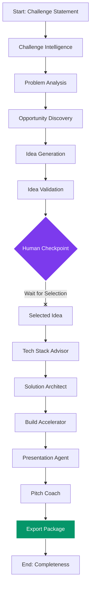

# 🚀 exHacker: Co-Pilot for Hackathon Teams

[](#)
[](https://www.python.org/)
[](https://nextjs.org/)
[](https://fastapi.tiangolo.com/)
[](https://github.com/langchain-ai/langgraph)
[](https://sqlite.org/)

**exHacker** is a resilient, multi-agent co-pilot that transforms a hackathon challenge statement into a complete, structured MVP project blueprint in under 5 minutes. It analyzes challenges, generates and validates ideas against live market signals, maps out technical architectures, designs databases and APIs, coordinates tasks, and drafts judge-ready slides and elevator pitch scripts.

---

## 🗺️ System Architecture & Workflow

exHacker operates on a state-persisted, 10-stage directed graph managed via **LangGraph**. The workflow pauses at a **Human-in-the-Loop Checkpoint** after validating generated ideas, allowing users to inspect the competitive research reports and select the winning idea before resuming the technical and presentation tracks.



---

## 🤖 Specialized AI Agents

Each node in our LangGraph orchestrator delegates to a specialized AI agent subclass of `BaseAgent`.

| Stage | Agent | Responsibilities | Inputs | Outputs |
| :--- | :--- | :--- | :--- | :--- |
| 1 | **Challenge Intelligence** | Extract themes, constraints, and evaluation criteria | `project.challenge_statements` | `challenge_intelligence` |
| 2 | **Problem Analyst** | Identify pain points, stakeholders, and success metrics | `challenge_intelligence`, `team_profile` | `problem_analysis` |
| 3 | **Opportunity Planner** | Discover market gaps, technical and impact opportunities | `challenge_intelligence`, `problem_analysis` | `opportunity_analysis` |
| 4 | **Idea Generator** | Generate 5 diverse product concepts with scores and features | All previous + `project` | `generated_ideas` |
| 5 | **Idea Validator** | Validate ideas against live market web search results | `generated_ideas`, Research results | `validation_reports` |
| 6 | **Tech Stack Advisor** | Suggest a practical, boring, deployable stack for the team | `selected_idea`, `team_profile`, `project` | `tech_stack` |
| 7 | **Solution Architect** | Design system layout, APIs, modular divisions, database schemas | `selected_idea`, `tech_stack` | `architecture` |
| 8 | **Build Accelerator** | Decompose MVP scope into detailed tasks with copy-paste prompts | `architecture`, `tech_stack` | `build_package`, `prompt_package` |
| 9 | **Presentation Agent** | Prepare 6 slide structures with content and visual guidelines | `selected_idea`, `architecture`, `validation_reports` | `presentation` |
| 10 | **Pitch Coach** | Draft 30s/2m/5m pitches, demo script, and judge simulator Q&A | `selected_idea`, `presentation`, `validation_reports` | `pitch` |

---

## ⚡ Key Moats & Features

*   **Resilient Fallback Inference**: Automatically queries **Groq (Llama 3)** → **Gemini 1.5 Flash** → **OpenAI** → **Local Ollama** to guarantee 100% API uptime during critical live judging demos.
*   **Persistent State Management**: Entire workflow states are serialized to SQLite after each node execution, enabling instant resuming from any failure point.
*   **Database logging context**: Uses `contextvars` to hook SQLAlchemy transactions directly into agent executions, logging performance metrics (duration, cost, tokens, and mock usage).
*   **Web Search Grounded Validation (Milestone 4)**: Uses the Tavily API to gather competitor SaaS, GitHub open-source repositories, and public APIs to cross-reference and rank ideas.

---

## 🛠️ Getting Started

### Directory Structure

```text
exHacker/
├── Docs/               # Master product specifications & guides
├── backend/            # FastAPI + LangGraph workflow service
└── frontend/           # Next.js 15 UI dashboard
```

### 1. Prerequisites
Ensure you have the following installed:
*   [Python 3.10+](https://python.org)
*   [Node.js 18+](https://nodejs.org)
*   [uv package manager](https://github.com/astral-sh/uv) (recommended) or `pip`

---

### 2. Backend Setup
Navigate into the `backend/` folder:
```bash
cd backend
# Copy configuration file
cp .env.example .env
```
Fill out the API keys in your `.env`:
*   `GROQ_API_KEY`: Comma-separated Groq API keys for rotation.
*   `GEMINI_API_KEY`: Google Gemini fallback API key.
*   `SEARCH_API_KEY`: Tavily Search API key (needed for Phase 4 Research).

Install dependencies and start development server:
```bash
# Run FastAPI Backend with hot reload (runs on http://localhost:8000)
uv run uvicorn app.api.main:app --reload
```
To run tests:
```bash
uv run pytest
```

---

### 3. Frontend Setup
Open a new terminal window and navigate into the `frontend/` folder:
```bash
cd frontend
# Install npm packages
npm install
# Run Next.js Development Server (runs on http://localhost:3000)
npm run dev
```

---

## 📄 Documentation Indices

For detailed system specs, refer to our documents in the `Docs/` directory:
*   [01_PRD.md](Docs/01_PRD.md) - Product Requirements Document
*   [03_System_Architecture.md](Docs/03_System_Architecture.md) - Backend Services layout
*   [04_Agent_Specifications.md](Docs/04_Agent_Specifications.md) - Rules and goals per agent
*   [06_State_Model.md](Docs/06_State_Model.md) - Complete Pydantic domain models
*   [10_Research_Architecture.md](Docs/10_Research_Architecture.md) - Research Pipeline & Novelty Scoring Formulas

---

## 📜 License
This project is licensed under the MIT License - see the [LICENSE](LICENSE) file for details.